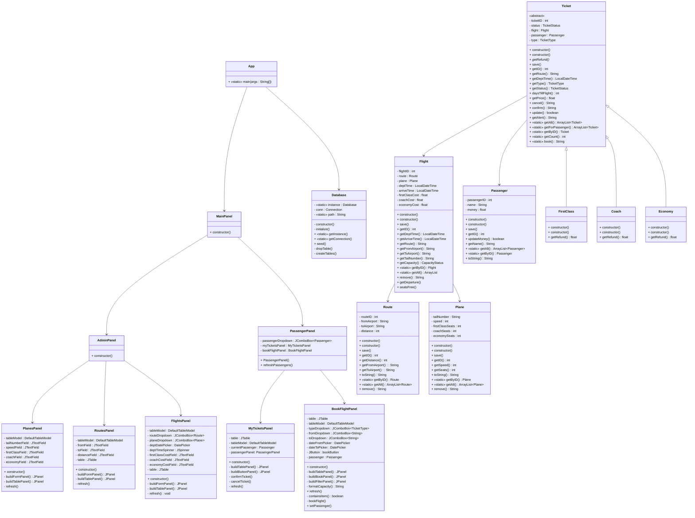

# Class Diagram

```mermaid
classDiagram
    App  -->  MainPanel
    App --> Database

    MainPanel --> AdminPanel
    MainPanel --> PassengerPanel

    AdminPanel --> PlanesPanel
    AdminPanel --> RoutesPanel
    AdminPanel --> FlightsPanel

    PassengerPanel --> MyTicketsPanel
    PassengerPanel --> BookFlightPanel

    Flight --> Route
    Flight --> Plane

    Ticket --> Passenger
    Ticket --> Flight

    Ticket <|-- FirstClass
    Ticket <|-- Coach
    Ticket <|-- Economy

    class App {
        + «static» main( args : String[] )
    }

    class Database {
        - «static» instance : Database
        - conn : Connection
        - «static» path : String
        - constructor()
        - initialize()
        + «static» getInstance()
        + «static» getConnection()
        + seed()
        - dropTable()
        - createTables()
    }

    class AdminPanel {
        + constructor()
    }

    class BookFlightPanel {
        - table : JTable
        - tableModel : DefaultTableModel
        - typeDropdown : JComboBox~TicketType~
        - fromDropdown : JComboBox~String~
        - toDropdown : JComboBox~String~
        - dateFromPicker : DatePicker
        - dateToPicker : DatePicker
        - JButton : bookButton
        - passenger : Passenger
        + constructor()
        - buildTablePanel() JPanel
        - buildBookPanel() JPanel
        - buildFilterPanel() JPanel
        - formatCapacity() String
        + refresh()
        - containsItem() boolean
        - bookFlight()
        + setPassenger()
    }

    class FlightsPanel {
        - tableModel : DefaultTableModel
        - routeDropdown : JComboBox~Route~
        - planeDropdown : JComboBox~Plane~
        - deptDatePicker : DatePicker
        - deptTimeSpinner : JSpinner
        - firstClassCostField : JTextField
        - coachCostField : JTextField
        - economyCostField : JTextField
        - table : JTable
        + constructor()
        - buildFormPanel() JPanel
        - buildTablePanel() JPanel
        - refresh() void
    }

    class MainPanel {
        + constructor()
    }

    class MyTicketsPanel {
        - table : JTable
        - tableModel : DefaultTableModel
        - currentPassenger : Passenger
        - passengerPanel: PassengerPanel
        + constructor()
        - buildTablePanel() JPanel
        - buildButtonPanel() JPanel
        - confirmTicket()
        - cancelTicket()
        - refresh()
    }

    class RoutesPanel {
        - tableModel : DefaultTableModel
        - fromField : JTextField
        - toField : JTextField
        - distanceField :  JTextField
        - table :  JTable
        + constructor()
        - buildFormPanel() JPanel
        - buildTablePanel() JPanel
        - refresh()

    }

    class PlanesPanel {
        - tableModel : DefaultTableModel
        - tailNumberField : JTextField
        - speedField : JTextField
        - firstClassField : JTextField
        - coachField : JTextField
        - economyField : JTextField
        + constructor()
        - buildFormPanel() JPanel
        - buildTablePanel() JPanel
        - refresh()
    }

    class PassengerPanel {
        - passengerDropdown : JComboBox~Passenger~
        - myTicketsPanel : MyTicketsPanel
        - bookFlightPanel : BookFlightPanel
        + PassengerPanel()
        + refreshPassengers()
    }

    class Passenger {
        - passengerID : int
        - name : String
        - money : float
        + constructor()
        + constructor()
        + save()
        + getID() int
        + updateMoney() boolean
        + getName() String
        + «static» getAll() ArrayList~Passenger~
        + «static» getByID() Passenger
        + toString() String
    }

    class Plane {
        - tailNumber : String
        - speed : int
        - firstClassSeats : int
        - coachSeats : int
        - economySeats : int
        + constructor()
        + constructor()
        + save()
        + getID() int
        + getSpeed() int
        + getSeats() int
        + toString() String
        + «static» getByID() Plane
        + «static» getAll() ArrayList~Plane~
        + remove() String
    }

    class Ticket {
        «abstract»
        - ticketID : int
        - status : TicketStatus
        - flight : Flight
        - passenger : Passenger
        - type : TicketType
        + constructor()
        + constructor()
        + getRefund()*
        + save()
        + getID() int
        + getRoute() String
        + getDeptTime() LocalDateTime
        + getType() TicketType
        + getStatus() TicketStatus
        + daysTillFlight() int
        + getPrice() float
        + cancel() String
        + confirm() String
        + update() boolean
        + getAlert() String
        + «static» getAll() ArrayList~Ticket~
        + «static» getForPassenger() ArrayList~Ticket~
        + «static» getByID() Ticket
        + «static» getCount() int
        + «static» book() String
    }

    class Flight {
        - flightID : int
        - route : Route
        - plane : Plane
        - deptTime : LocalDateTime
        - arriveTime : LocalDateTime
        - firstClassCost : float
        - coachCost : float
        - economyCost : float
        + constructor()
        + constructor()
        + save()
        + getID() int
        + getDeptTime() LocalDateTime
        + getArriveTime() LocalDateTime
        + getRoute() String
        + getFromAirport() String
        + getToAirport() String
        + getTailNumber() String
        + getCapacity() CapacityStatus
        + «static» getByID() Flight
        + «static» getAll() ArrayList<Flight>
        + remove() String
        + getDeparture()
        + seatsFree()
    }

    class Route {
        - routeID : int
        - fromAirport : String
        - toAirport : String
        - distance : int
        + constructor()
        + constructor()
        + save()
        + getID() int
        + getDistance() int
        + getFromAirport() : String
        + getToAirport() : String
        + toString() String
        + «static» getByID() Route
        + «static» getAll() ArrayList~Route~
        + remove() String
    }

    class FirstClass {
        + constructor()
        + constructor()
        + getRefund() float
    }

    class Coach {
        + constructor()
        + constructor()
        + getRefund() float
    }

    class Economy {
        + constructor()
        + constructor()
        + getRefund() float
    }

```
