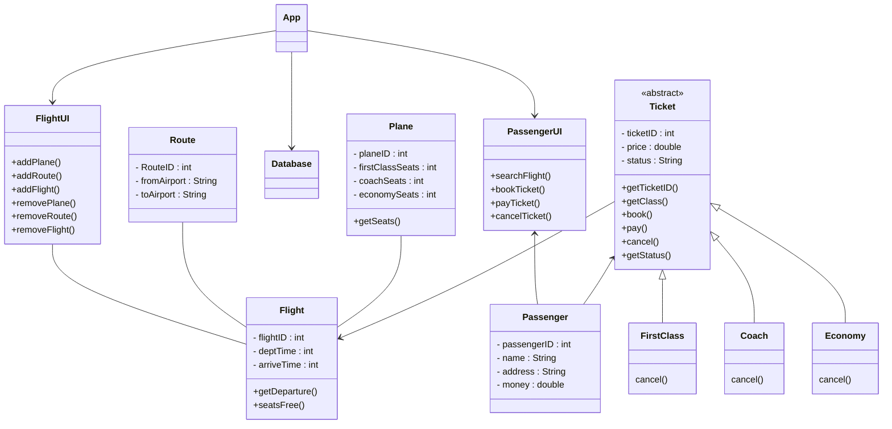

# Class Diagram

```mermaid
classDiagram
    App  -->  FlightUI
    FlightUI  --  Flight

    App --> PassengerUI
    PassengerUI <-- Passenger

    App --> Database

    Route -- Flight
    Plane -- Flight

    Ticket <-- Passenger
    Ticket --> Flight

    Ticket <|-- FirstClass
    Ticket <|-- Coach
    Ticket <|-- Economy

    class App {

    }

    class FlightUI {
        +addPlane()
        +addRoute()
        +addFlight()
        +removePlane()
        +removeRoute()
        +removeFlight()
    }

    class PassengerUI {
        +searchFlight()
        +bookTicket()
        +payTicket()
        +cancelTicket()
    }

    class Passenger {
        - passengerID : int
        - name : String
        - address : String
        - money : double
    }

    class Plane {
        - planeID : int
        - firstClassSeats : int
        - coachSeats : int
        - economySeats : int
        +getSeats()
    }

    class Ticket {
        <<abstract>>
        - ticketID : int
        - price : double
        - status : String
        +getTicketID()
        +getClass()
        +book()
        +pay()
        +cancel()
        +getStatus()
    }

    class Flight {
        - flightID : int
        - deptTime : int
        - arriveTime : int
        +getDeparture()
        +seatsFree()
    }

    class Route {
        - RouteID : int
        - fromAirport : String
        - toAirport : String
    }

    class FirstClass {
        cancel()
    }

    class Coach {
        cancel()
    }

    class Economy {
        cancel()
    }

```
