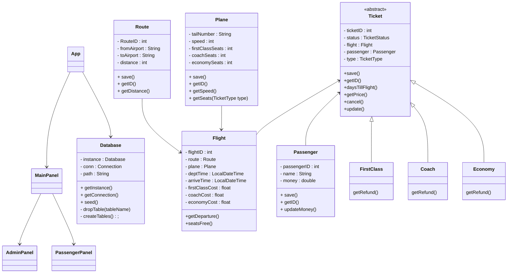

# Class Diagram

```mermaid
classDiagram
    App  -->  MainPanel
    App --> Database

    MainPanel --> AdminPanel
    MainPanel --> PassengerPanel

    Route --> Flight
    Plane --> Flight

    Ticket <-- Passenger
    Ticket <-- Flight

    Ticket <|-- FirstClass
    Ticket <|-- Coach
    Ticket <|-- Economy

    class App {

    }

    class Database {
        - instance : Database
        - conn : Connection
        - path : String
        + getInstance()
        + getConnection()
        + seed()
        - dropTable( tableName )
        - createTables();

    }

    class MainPanel {
    
    }

    class AdminPanel {

    }

    class PassengerPanel {

    }

    class Passenger {
        - passengerID : int
        - name : String
        - money : double
        + save()
        + getID()
        + updateMoney()
    }

    class Plane {
        - tailNumber : String
        - speed : int
        - firstClassSeats : int
        - coachSeats : int
        - economySeats : int
        + save()
        + getID()
        + getSpeed()
        + getSeats( TicketType type )
    }

    class Ticket {
        <<abstract>>
        - ticketID : int
        - status : TicketStatus
        - flight : Flight
        - passenger : Passenger
        - type : TicketType
        +save()
        +getID()
        +daysTillFlight()
        +getPrice()
        +cancel()
        +update()
    }

    class Flight {
        - flightID : int
        - route : Route
        - plane : Plane
        - deptTime : LocalDateTime
        - arriveTime : LocalDateTime
        - firstClassCost : float
        - coachCost : float
        - economyCost : float
        +getDeparture()
        +seatsFree()
    }

    class Route {
        - RouteID : int
        - fromAirport : String
        - toAirport : String
        - distance : int
        + save()
        + getID()
        + getDistance()
    }

    class FirstClass {
        getRefund()
    }

    class Coach {
        getRefund()
    }

    class Economy {
        getRefund()
    }

```
