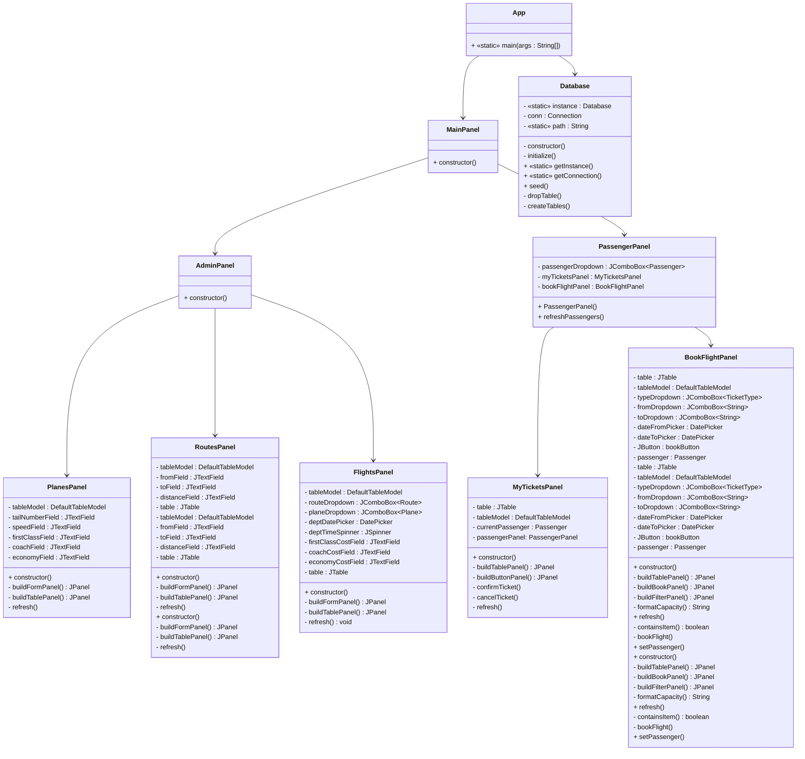

#DCD App Diagram

```mermaid
classDiagram
    
    direction TB
    PassengerPanel --> MyTicketsPanel
    PassengerPanel --> BookFlightPanel

    App  -->  MainPanel
    App --> Database

    MainPanel --> AdminPanel
    MainPanel --> PassengerPanel

    AdminPanel --> PlanesPanel
    AdminPanel --> RoutesPanel
    AdminPanel --> FlightsPanel

    class AdminPanel {
        + constructor()
    }

    class App {
        + «static» main( args : String[] )
    }


    class BookFlightPanel {
        - table : JTable
        - tableModel : DefaultTableModel
        - typeDropdown : JComboBox~TicketType~
        - fromDropdown : JComboBox~String~
        - toDropdown : JComboBox~String~
        - dateFromPicker : DatePicker
        - dateToPicker : DatePicker
        - JButton : bookButton
        - passenger : Passenger
        + constructor()
        - buildTablePanel() JPanel
        - buildBookPanel() JPanel
        - buildFilterPanel() JPanel
        - formatCapacity() String
        + refresh()
        - containsItem() boolean
        - bookFlight()
        + setPassenger()
    }

    class BookFlightPanel {
        - table : JTable
        - tableModel : DefaultTableModel
        - typeDropdown : JComboBox~TicketType~
        - fromDropdown : JComboBox~String~
        - toDropdown : JComboBox~String~
        - dateFromPicker : DatePicker
        - dateToPicker : DatePicker
        - JButton : bookButton
        - passenger : Passenger
        + constructor()
        - buildTablePanel() JPanel
        - buildBookPanel() JPanel
        - buildFilterPanel() JPanel
        - formatCapacity() String
        + refresh()
        - containsItem() boolean
        - bookFlight()
        + setPassenger()
    }

    class FlightsPanel {
        - tableModel : DefaultTableModel
        - routeDropdown : JComboBox~Route~
        - planeDropdown : JComboBox~Plane~
        - deptDatePicker : DatePicker
        - deptTimeSpinner : JSpinner
        - firstClassCostField : JTextField
        - coachCostField : JTextField
        - economyCostField : JTextField
        - table : JTable
        + constructor()
        - buildFormPanel() JPanel
        - buildTablePanel() JPanel
        - refresh() void
    }

    class MainPanel {
        + constructor()
    }

    class MyTicketsPanel {
        - table : JTable
        - tableModel : DefaultTableModel
        - currentPassenger : Passenger
        - passengerPanel: PassengerPanel
        + constructor()
        - buildTablePanel() JPanel
        - buildButtonPanel() JPanel
        - confirmTicket()
        - cancelTicket()
        - refresh()
    }

    class RoutesPanel {
        - tableModel : DefaultTableModel
        - fromField : JTextField
        - toField : JTextField
        - distanceField :  JTextField
        - table :  JTable
        + constructor()
        - buildFormPanel() JPanel
        - buildTablePanel() JPanel
        - refresh()

    }

    class PlanesPanel {
        - tableModel : DefaultTableModel
        - tailNumberField : JTextField
        - speedField : JTextField
        - firstClassField : JTextField
        - coachField : JTextField
        - economyField : JTextField
        + constructor()
        - buildFormPanel() JPanel
        - buildTablePanel() JPanel
        - refresh()
    }

    class PassengerPanel {
        - passengerDropdown : JComboBox~Passenger~
        - myTicketsPanel : MyTicketsPanel
        - bookFlightPanel : BookFlightPanel
        + PassengerPanel()
        + refreshPassengers()
    }

    class RoutesPanel {
        - tableModel : DefaultTableModel
        - fromField : JTextField
        - toField : JTextField
        - distanceField :  JTextField
        - table :  JTable
        + constructor()
        - buildFormPanel() JPanel
        - buildTablePanel() JPanel
        - refresh()

    }

    class Database {
        - «static» instance : Database
        - conn : Connection
        - «static» path : String
        - constructor()
        - initialize()
        + «static» getInstance()
        + «static» getConnection()
        + seed()
        - dropTable()
        - createTables()
    }


```

