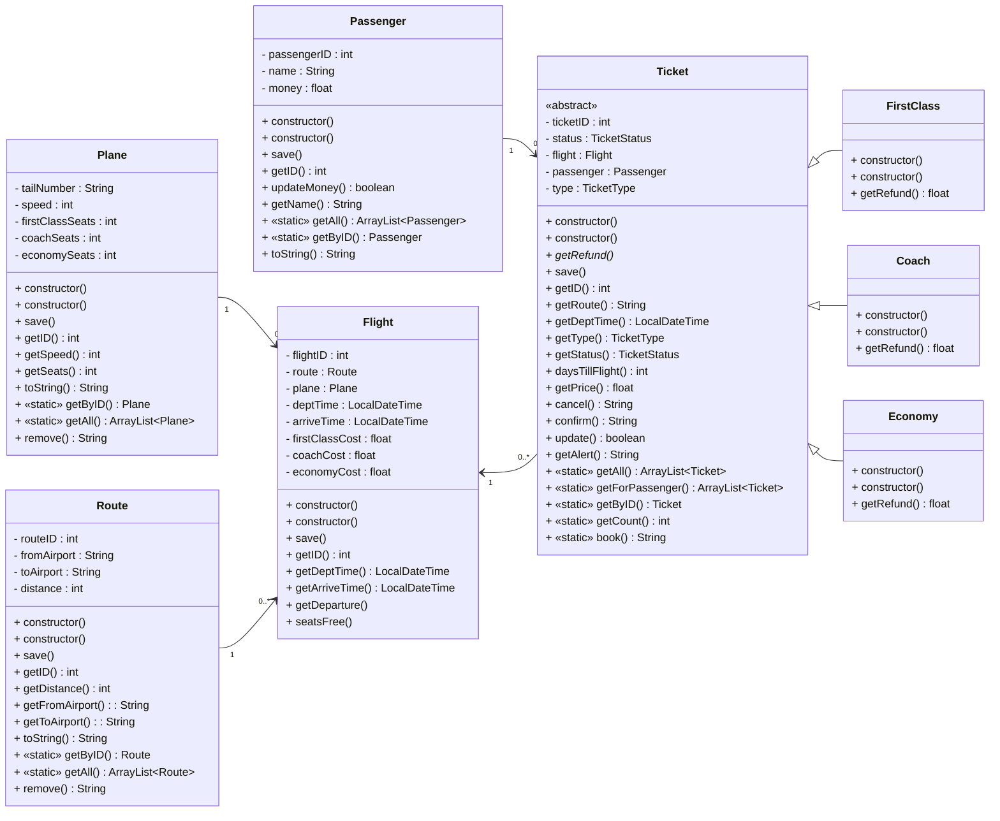

#DCD Diagram

```mermaid
classDiagram
direction LR


Ticket <|-- FirstClass
Ticket <|-- Coach
Ticket <|-- Economy


Passenger "1" --> "0..*" Ticket
Flight "1" <-- "0..*" Ticket
Plane "1" --> "0..*" Flight
Route "1" --> "0..*" Flight

    class Flight { - flightID : int 
    - route : Route 
    - plane : Plane 
    - deptTime : LocalDateTime 
    - arriveTime : LocalDateTime 
    - firstClassCost : float 
    - coachCost : float 
    - economyCost : float 
    + constructor() 
    + constructor() 
    + save() 
    + getID() int
    + getDeptTime() LocalDateTime 
    + getArriveTime() LocalDateTime
    + getDeparture() 
    + seatsFree() 
    }
    class Passenger {
        - passengerID : int
        - name : String
        - money : float
        + constructor()
        + constructor()
        + save()
        + getID() int
        + updateMoney() boolean
        + getName() String
        + «static» getAll() ArrayList~Passenger~
        + «static» getByID() Passenger
        + toString() String
    }

    class Plane {
        - tailNumber : String
        - speed : int
        - firstClassSeats : int
        - coachSeats : int
        - economySeats : int
        + constructor()
        + constructor()
        + save()
        + getID() int
        + getSpeed() int
        + getSeats() int
        + toString() String
        + «static» getByID() Plane
        + «static» getAll() ArrayList~Plane~
        + remove() String
    }


    class Ticket {
        «abstract»
        - ticketID : int
        - status : TicketStatus
        - flight : Flight
        - passenger : Passenger
        - type : TicketType
        + constructor()
        + constructor()
        + getRefund()*
        + save()
        + getID() int
        + getRoute() String
        + getDeptTime() LocalDateTime
        + getType() TicketType
        + getStatus() TicketStatus
        + daysTillFlight() int
        + getPrice() float
        + cancel() String
        + confirm() String
        + update() boolean
        + getAlert() String
        + «static» getAll() ArrayList~Ticket~
        + «static» getForPassenger() ArrayList~Ticket~
        + «static» getByID() Ticket
        + «static» getCount() int
        + «static» book() String
    }

class Route {
    - routeID : int
    - fromAirport : String
    - toAirport : String
    - distance : int
    + constructor()
    + constructor()
    + save()
    + getID() int
    + getDistance() int
    + getFromAirport() : String
    + getToAirport() : String
    + toString() String
    + «static» getByID() Route
    + «static» getAll() ArrayList~Route~
    + remove() String
    }

class FirstClass{
    + constructor()
    + constructor()
    + getRefund() float
}
class Coach{
    + constructor()
    + constructor()
    + getRefund() float
}
class Economy{
    + constructor()
    + constructor()
    + getRefund() float
}

```